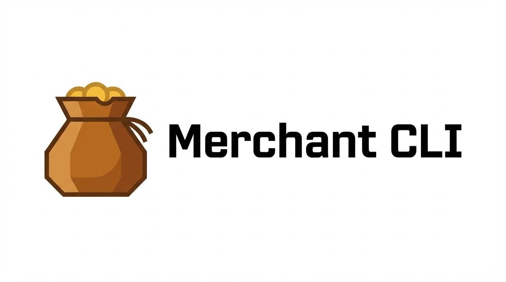

<p align="center">
  
</p>

<p align="center">
  <a href="https://packagist.org/packages/deivao06/merchant-cli"></a>
  <a href="https://packagist.org/packages/deivao06/merchant-cli"></a>
  <a href="https://packagist.org/packages/deivao06/merchant-cli"></a>
</p>

A command-line trading game where you play as a merchant, trading with other players on the same network to grow your city.

## About the Game

Merchant CLI is a multiplayer game that runs in your terminal. The core gameplay revolves around trading resources with other players to acquire the materials needed to upgrade your city. Each player manages their own city, and the goal is to become the most prosperous merchant.

## Features

*   **Multiplayer Trading:** Trade resources with other players on the same LAN (Coming Soon).
*   **City Management:** Build and upgrade your city to increase your production and unlock new abilities.
*   **Resources production:** All resources are produced per minute.
*   **Biomes:** Random selected on city creation and directly affects resource production.
*   **Resources:**
    - **Gold:** Universal currency used for trade.
    - **Food:** Keeps your population fed an is required for some upgrades.
    - **Wood:** Basic building material.
    - **Stone:** Used for strong structures and upgrades.
*  **Buildings:**
    - **Farm:** Produces food.
    - **Sawmill:** Produces wood.
    - **Quarry:** Produces stone.

## Installation

You can install the merchant-cli globally using Composer:

```bash
composer global require deivao06/merchant-cli
```

Alternatively, you can clone the repository and install dependencies:

1.  Clone the repository:
    ```bash
    git clone https://github.com/your-username/merchant-cli.git
    ```
2.  Install the dependencies:
    ```bash
    composer install
    ```
3.  Run the game:
    ```bash
    php merchant-cli
    ```

## How to Play

### Initialize a new game

To start a new game, run the `game:init` command. This will create a new game world and save file.

```bash
merchant-cli game:init
```

### Check your game status

To see the current status of your city, resources, and buildings, use the `game:status` command.

```bash
merchant-cli game:status
```

### Trading

_(Coming soon)_

## Development

This project is built with PHP and the Laravel Zero framework.

### Running tests

To run the test suite, use the following command:

```bash
./vendor/bin/pest
```

## Contributing

Contributions are welcome! Please feel free to submit a pull request or open an issue.
Before contributing, please read our development guide.

**[Development Guide](docs/DEVELOPMENT.md)** - Essential reading for contributors

#### Quick start for Contributors:

1. Fork the project
2. Create your Feature Branch from `dev` (never from `master`)
3. Ensure all tests pass and add tests for new features
4. Commit your changes using conventional commit format
5. Push to the Branch
6. Open a Pull Request to the `dev` branch

**Important:** Never commit directly to the `master` branch. All changes must go through the `dev` branch first.

## Authors
[@deivao06](https://github.com/deivao06)
